# Das Wahre Schlagerfest

Branch||
---|---|---
master||
develop||

Das Wahre Schlagerfest is a Truly Fun Game with an Oktoberfest theme,
programmed in C++ using Qt (see 'About the program' for more details).

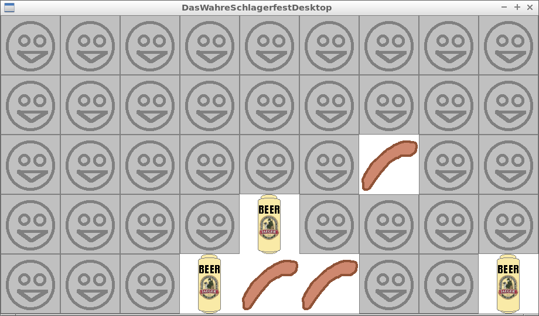

# Downloads

 * [Download the Windows executable](http://richelbilderbeek.nl/GameDasWahreSchlagerfestExe.zip)

# About the program

Das Wahre Schlagerfest is programmed in C++14 using the STL, [Boost](http://www.boost.org) and [Qt](http://www.qt.io) libraries.

Das Wahre Schlagerfest is cross-compiled using [MXE](http://mxe.cc) in the bash shell scripts.

# I want to contribute!

Awesome!

You can collaborate by
 * email richelbilderbeek (at [Richel Bilderbeek's webpage its 'Contact Me' section](http://www.richelbilderbeek.nl/Contact.htm))
 * add a GitHub issue: this can be a question, suggestion, or whatever
 * fork this repository, make the changes, and submit a pull request. 

# Screenshot archive

The most recent screenshots are at the top.

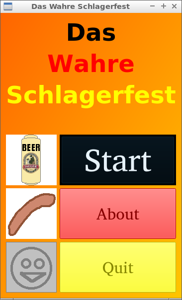
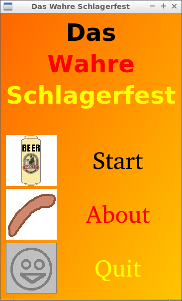

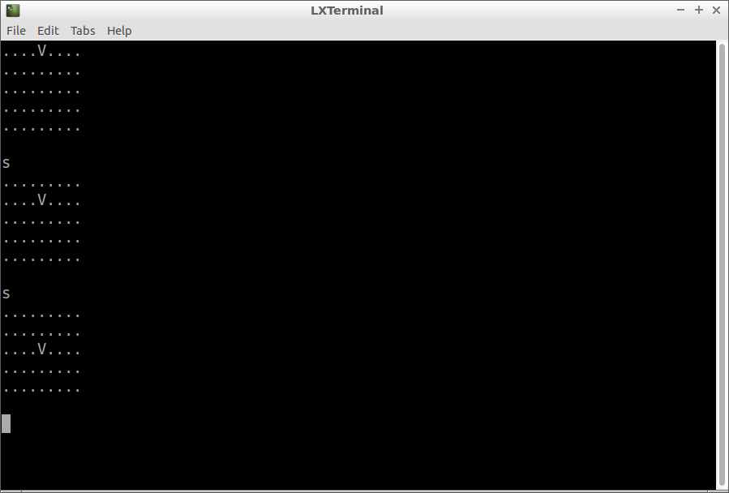

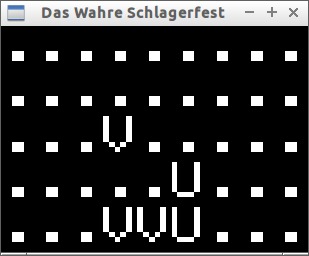
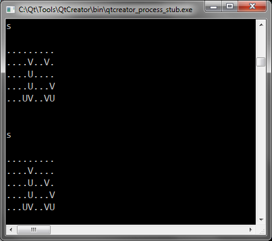

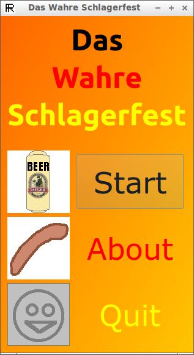
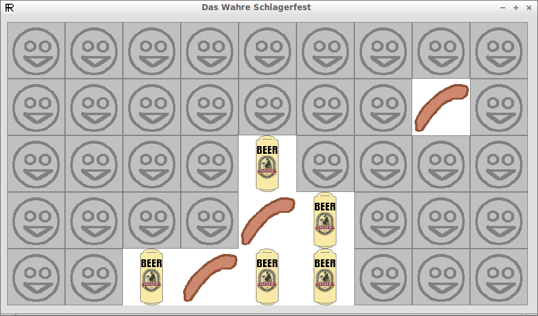

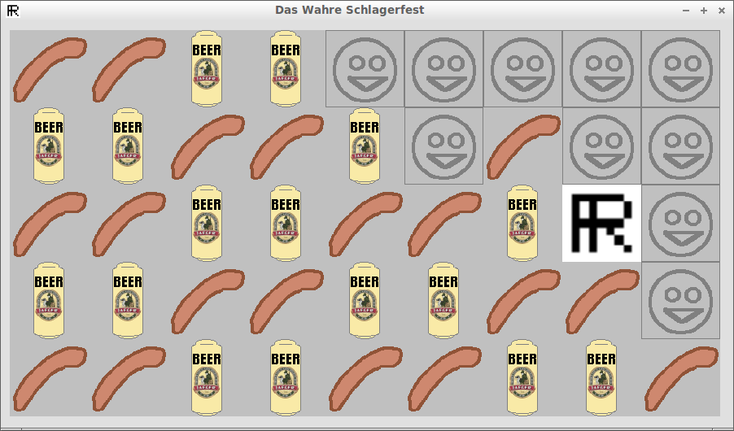

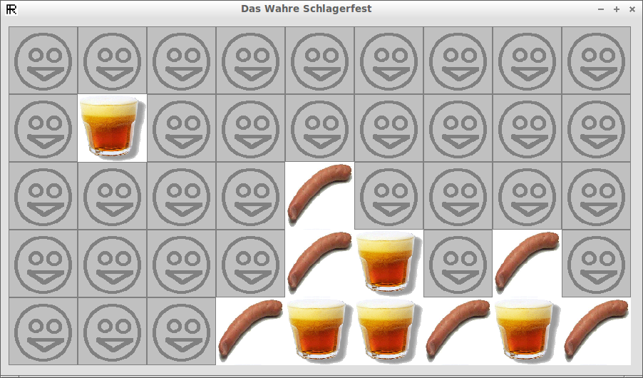

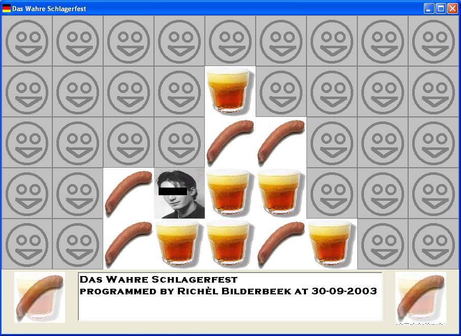

## External links

 * [Richel Bilderbeek's games](https://github.com/richelbilderbeek/Games)
